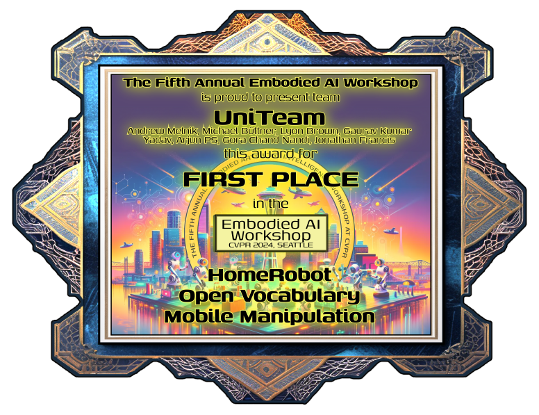

<!-- Announcements and news can be much longer than just quick inline posts. In fact, they can have all the features available for the standard blog posts. See below. -->

---

The embodied AI Challenge involved designing an embodied AI agent that is capable of navigating unfamiliar environments, recognizing open vocabulary classes and manipulating novel objects.

<a href="https://embodied-ai.org/">**Workshop website**</a>

Our solution is avilable at - <a href="https://arxiv.org/abs/2407.06939">**Towards Open-World Mobile Manipulation in Homes: Lessons from the Neurips 2023 HomeRobot Open Vocabulary Mobile Manipulation Challenge**</a>
